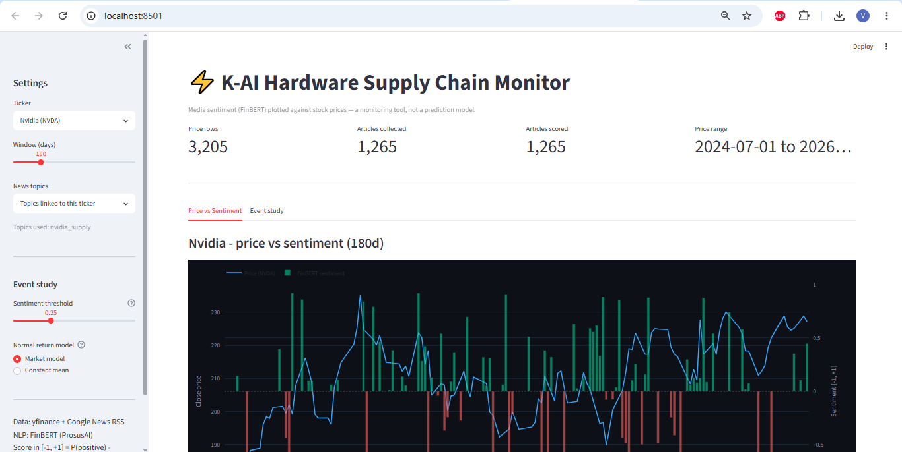

# K-AI Hardware Tracker

[](https://github.com/v-berardi/kai-tracker/actions/workflows/tests.yml)

I built this project to follow the news about the AI memory chip supply
chain (SK Hynix, Nvidia, Samsung, TSMC) and compare it with their stock
prices. It collects news headlines and prices, scores each headline
with a financial NLP model (FinBERT), and then uses an event study to
check if sentiment spikes are followed by unusual stock returns.

**This is a monitoring tool, not a trading tool.** It does not try to
predict prices. It checks if there is a link between news sentiment and
stock returns, and it shows the real result, even when the result is
"no clear link".



## Why I built this

I wanted a project with a full, real pipeline: collect data, store it,
run an NLP model on it, and check the result with a real statistical
test, instead of just supposing that sentiment and prices are linked.
I also wanted to practice building a small dashboard on top of it.

## The pipeline

```
scripts/run_ingestion.py   -->  prices + market indexes (yfinance) + news (Google News RSS)
scripts/run_sentiment.py   -->  scores the new headlines with FinBERT
scripts/run_event_study.py -->  checks if sentiment spikes are followed by abnormal returns
app/dashboard.py           -->  Streamlit dashboard with all of the above
```

Project layout:

```
kai-tracker/
├── .github/workflows/tests.yml  # CI: ruff + pytest on every push
├── .streamlit/config.toml       # dark theme for the dashboard
├── app/
│   └── dashboard.py             # Streamlit + Plotly dashboard
├── data/                        # SQLite database (created on first run, not in git)
├── docs/dashboard.png           # screenshot for this README
├── validation/                  # labeled headlines to check FinBERT
├── scripts/
│   ├── run_ingestion.py         # collect prices + news
│   ├── run_sentiment.py         # score the headlines with FinBERT
│   ├── run_event_study.py       # event study results (one or all tickers)
│   └── validate_finbert.py      # compare FinBERT with my own labels
├── src/
│   ├── config.py                # tickers, topics, time zones, indexes, settings
│   ├── ingestion/
│   │   ├── market.py            # prices from yfinance
│   │   └── news.py              # news from Google News RSS
│   ├── nlp/
│   │   ├── sentiment.py         # FinBERT scoring
│   │   └── validation.py        # metrics to check FinBERT
│   ├── storage/
│   │   └── db.py                # SQLite functions
│   └── analysis/
│       └── event_study.py       # the event study and the tests
├── tests/                       # unit tests (no network, no real database)
├── requirements.txt
└── ruff.toml                    # linter settings
```

## Results, and why I'm not hiding them

### The data

- **Prices:** daily prices of the 4 stocks and of the 2 indexes (SOXX
  and KOSPI) since July 2024, from yfinance.
- **News:** 1,265 headlines from the 6 Google News topics, all scored
  by FinBERT. Most of them are recent, because the RSS feed only gives
  the latest articles (the first Nvidia event is in February 2026).
- **Events** (days with |sentiment| >= 0.25, market model):

| Stock | Detected | Skipped: not enough prices | Skipped: overlap | Skipped: baseline too short | Kept |
|---|---:|---:|---:|---:|---:|
| Nvidia | 18 | 1 | 5 | 6 | 6 |
| SK Hynix | 27 | 2 | 12 | 6 | 7 |
| Samsung | 45 | 2 | 5 | 31 | 7 |
| TSMC | 13 | 1 | 5 | 0 | 7 |

An event is skipped if its window overlaps the window of the previous
event, or if there are less than 30 "clean" days (outside any event
window) to estimate its normal return.

### Event study

I ran the study on the 4 stocks with
`python scripts/run_event_study.py --all-tickers` (market model,
threshold 0.25, news topics of each ticker). I decided before running
it that I would report the 4 stocks, whatever the result.

```
   ticker    group  n CAAR after p after CAAR before p before CAAR full p full
     NVDA      all  6    +0.0032   0.908     +0.0353    0.050   +0.0385  0.253
     NVDA positive <5
     NVDA negative <5
000660.KS      all  7    +0.0050   0.612     +0.0203    0.547   +0.0253  0.525
000660.KS positive  6    +0.0039   0.738     +0.0313    0.415   +0.0352  0.449
000660.KS negative <5
005930.KS      all  7    -0.0014   0.935     +0.0116    0.513   +0.0103  0.738
005930.KS positive  5    -0.0114   0.618     +0.0009    0.966   -0.0105  0.793
005930.KS negative <5
      TSM      all  7    +0.0203   0.038     -0.0055    0.707   +0.0148  0.409
      TSM positive  6    +0.0229   0.043     -0.0044    0.800   +0.0185  0.380
      TSM negative <5

21 tests in total. p < 0.05: 2 (about 1.1 expected by chance only).
With the Bonferroni correction (p < 0.0024): 0.
Groups with less than 5 events have no test (n = <5).
```

**Main result: no clear link.** For the main question (do returns move
*after* a sentiment spike, days [0, +5]), 3 stocks out of 4 are far
from significant. Only TSMC has p < 0.05 (p = 0.038, and 0.043 for the
positive events only), but I don't think it is a real effect:

- With the constant mean model, the same TSMC events give p = 0.774.
  A real effect should not disappear when I change the baseline.
- It is only 7 events.
- There are 21 tests: 2 are below 0.05, and about 1 is expected by
  chance only. With the Bonferroni correction, none is significant.

**Market model vs constant mean.** Changing the baseline changes the
results a lot, which shows why the market model was needed
(`--all-tickers --model constant` gives the old numbers):

- Nvidia "after": +2.94% with the constant mean, +0.32% with the
  market model. The rise I saw before was the whole chip sector going
  up, not a reaction to the news.
- SK Hynix "after": -6.29% (p = 0.054) with the constant mean, +0.50%
  (p = 0.61) with the market model. The KOSPI was going down on those
  days, and the constant mean counted this as abnormal.

**The only pattern that stays with both models:** for Nvidia, the
stock goes up *before* the event (before CAAR +3.1% with the constant
mean, +3.5% with the market model, p between 0.05 and 0.09). This fits
the idea that the headlines follow the price: positive articles come
after the stock already went up. But with 6 events and after the
Bonferroni correction, it is only a hint, not a result.

Also, each version of my method gave a different "significant" result
(first "positive news, then lower returns", then the full window for
Nvidia, now TSMC). When the "significant" result moves each time the
method changes, it is a typical sign of noise.

I'm showing this instead of only the "clean" not-significant numbers
because that's the actual point of running a statistical test: to see
what the data says, including the part that doesn't fit a simple
story, instead of only keeping the result that looks good.

## Is FinBERT right on my headlines?

FinBERT was trained on financial news, not on chip industry headlines
from Google News. So I checked it on a random sample of my data:

```bash
python scripts/validate_finbert.py sample --n 50   # 50 random headlines (seed 42)
# labels in validation/headlines_to_label.csv (see below)
python scripts/validate_finbert.py evaluate
```

**The labels.** The rule: is this headline good or bad news for an
investor in the company of the topic (SK Hynix for `sk_hynix_hbm`,
Nvidia for `nvidia_supply`, ...)? If it is mixed or not clear, it is
neutral. The labels were proposed by an LLM (Claude) with this rule,
without seeing the FinBERT answer. This is a limit: LLM labels are not
a perfect ground truth, so these numbers show how much FinBERT agrees
with another reader, not its exact accuracy.

**Result on 50 headlines:**

```
Accuracy:       60.0%   (95% interval: about 46% to 72%)
Always 'positive': 42.0%  (trivial baseline)
Cohen's kappa:  0.39

Confusion matrix (rows = label, columns = FinBERT):
          positive  negative  neutral
positive        12         0        9
negative         4         8        2
neutral          4         1       10
```

FinBERT does better than the trivial baseline, but the agreement is
only "fair" (kappa 0.39). Two kinds of errors:

- **FinBERT is too careful:** 9 of the 21 good news are "neutral" for
  it.
- **Sometimes it gets the sign wrong:** 4 of the 14 bad news are
  "positive" for it. FinBERT reads the tone of the sentence, but it
  doesn't know for which company the news is good or bad. For example,
  "Samsung to overtake SK Hynix" sounds positive, but it is bad news
  for SK Hynix, the company of the topic.
- When FinBERT says "negative", it is almost always right (precision
  0.89).

**What it means for the event study:** the sentiment signal is noisy,
and some events probably have the wrong sign. This makes a real effect
harder to find, so it is one more reason to read the "no clear link"
result carefully. A better next step would be a model that knows the
target company (entity-level sentiment), or FinBERT fine-tuned on
labeled chip headlines.

## How to run it

```bash
python -m venv .venv
.venv\Scripts\Activate.ps1        # Windows (PowerShell)
source .venv/bin/activate          # Linux / macOS
pip install -r requirements.txt

python scripts/run_ingestion.py             # 1. collect prices + news
python scripts/run_sentiment.py --limit 20  # 2. score a small batch first
python scripts/run_sentiment.py             #    then score the rest
python scripts/run_event_study.py --all-tickers  # 3. results for the 4 tickers
streamlit run app/dashboard.py              # 4. open the dashboard
```

The first time `run_sentiment.py` runs, it downloads FinBERT (about
440MB, then it stays in the cache). Scoring is incremental: only the
new articles are scored.

The scripts can run many times without problem: prices are updated in
place and an article is never added twice (checked by URL).

Other options of the event study:

```bash
python scripts/run_event_study.py --ticker NVDA                   # details for one ticker
python scripts/run_event_study.py --all-tickers --model constant  # old baseline, to compare
```

### Running the tests

```bash
pytest -v
ruff check .
```

The tests use small made-up data where I know the answer in advance:
event detection, overlapping events, the minimum number of events,
the market model (it must find the beta I used to build the data), the
t-test (compared with scipy), time zones, and the FinBERT metrics (an
example computed by hand). The database tests use a temporary SQLite
file, so the tests need no network, no model and no real database.
GitHub Actions runs them, with the ruff linter, on every push.

## What works

- Collecting the prices of 4 stocks + 2 indexes and the news of 6
  topics runs end to end and fills the database.
- FinBERT scoring is incremental: only the new articles are scored.
- The event study runs on real data, and I trust the logic because
  the unit tests check it on data where I know the right answer.
- The dashboard shows price vs sentiment and the event study results,
  with a choice between the two baselines.

## What's limited

- **Google News RSS is one source, in English only.** It probably
  misses a lot of Korean news, which matters a lot for SK Hynix and
  Samsung.
- **FinBERT only reads the headline, not the full article.** It is
  faster, but a headline loses some nuance. And on my headlines it
  only agrees "fairly" with the labels (kappa 0.39, see above).
- **Not many events.** Google News RSS only gives around 100 recent
  articles per query, so the news history is much shorter than the 2
  years of prices, and it only grows if I run the ingestion often.
  After removing the overlapping events, only 6 or 7 events are left per
  stock, which is too few for a strong conclusion. I don't run any test
  under 5 events.
- **The market index contains the stock itself.** Nvidia and TSMC are
  big parts of the SOXX ETF, and Samsung and SK Hynix are big parts of
  the KOSPI. When Nvidia moves, the index also moves a bit because of
  Nvidia, so the market model removes a part of Nvidia's own abnormal
  return. A cleaner benchmark would be the index without the stock, but
  I don't have this data for free.
- **Samsung events are too frequent.** With the 0.25 threshold, most of
  the Samsung trading days are inside an event window, so many events
  have no clean baseline and are skipped. I didn't change the threshold
  after seeing the results, to not tune the method on the data I test
  it on.

## Design choices

- **Collecting and scoring are two separate steps.** A new article
  gets a `sentiment_score` of NULL, and a second script fills it later.
  So collecting news never waits for the NLP model to load.
- **RSS instead of scraping the Google News website.** The RSS feed is
  simple XML and its format changes less often than a web page.
- **Each news feed runs on its own**, so if one fails, the others still
  work.
- **SQLite**: no server to run, and a UNIQUE constraint on the URL
  removes the duplicates for free.
- **Every row stores when it was last written** (`ingested_at_utc`).
  For news it is when I collected the article. For prices it is the
  last update, because prices are rewritten at each run (yfinance
  changes old adjusted prices after splits and dividends). I use it
  only to check the data, the event study doesn't use it.
- **Each ticker uses only its own news topics** (`TICKER_TOPICS` in
  `src/config.py`). At first all the topics were mixed together, so a
  headline about Samsung could create an event that was then tested on
  Nvidia's price.
- **News is matched to the right trading day.** News times are in UTC,
  but Nvidia trades in New York and SK Hynix in Seoul. I convert each
  headline to the local time of the exchange, and if it comes out after
  the close, it counts for the next trading day (`MARKET_HOURS`).
- **Market model for the normal return.** At first I used the constant
  mean (normal return = average return of the stock before the event).
  On Nvidia it gave a strange result: in several events the normal
  return was negative because the stock was going down in the
  estimation window, so any rebound looked "abnormal". Now I fit
  `stock return = alpha + beta * index return` on the estimation
  window, with SOXX (US chip stocks) for Nvidia and TSMC and the KOSPI
  for Samsung and SK Hynix (`BENCHMARKS`). A day where the whole market
  goes up is not counted as abnormal anymore. `--model constant` keeps
  the old baseline, to compare.
- **±5 trading day event window**: about a week on each side, long
  enough to see if the market keeps reacting, short enough that another
  news story is not likely to land in the same window.
- **The CAR is split in "before" [-5, -1] and "after" [0, +5].** My
  question is if returns move *after* the news, so "after" is the main
  test. "Before" is still useful: a lot of headlines talk about a move
  that already happened ("Nvidia shares jump"), so a big "before" CAR
  means the news follows the price and not the opposite.
- **Events do not overlap.** The t-test supposes independent events.
  If two event windows share some days, the same returns are counted
  two times and the test looks more significant than it really is. So I
  skip an event if it starts inside the window of the previous one, and
  I remove the event window days from the "normal return" of the other
  events.
- **All tickers are reported together.** `--all-tickers` prints one
  table with the number of tests and a Bonferroni correction. I report
  the 4 stocks, because keeping only the ticker with the best p-value
  would be p-hacking.

## License

MIT, see [LICENSE](LICENSE).

## Author

Vincent Berardi, data science master's student at EURECOM. Personal
project to practice data collection, NLP and statistics.
